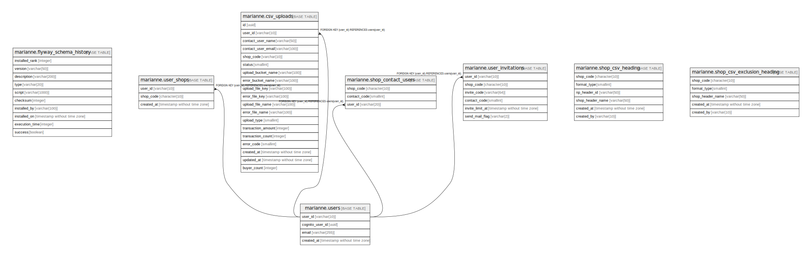

# npdb

## Tables

| Name | Columns | Comment | Type |
| ---- | ------- | ------- | ---- |
| [marianne.flyway_schema_history](marianne.flyway_schema_history.md) | 10 |  | BASE TABLE |
| [marianne.users](marianne.users.md) | 4 |  | BASE TABLE |
| [marianne.user_shops](marianne.user_shops.md) | 3 |  | BASE TABLE |
| [marianne.csv_uploads](marianne.csv_uploads.md) | 19 |  | BASE TABLE |
| [marianne.shop_contact_users](marianne.shop_contact_users.md) | 3 |  | BASE TABLE |
| [marianne.user_invitations](marianne.user_invitations.md) | 6 |  | BASE TABLE |
| [marianne.shop_csv_heading](marianne.shop_csv_heading.md) | 6 |  | BASE TABLE |
| [marianne.shop_csv_exclusion_heading](marianne.shop_csv_exclusion_heading.md) | 5 |  | BASE TABLE |

## Relations

---

> Generated by [tbls](https://github.com/k1LoW/tbls)
