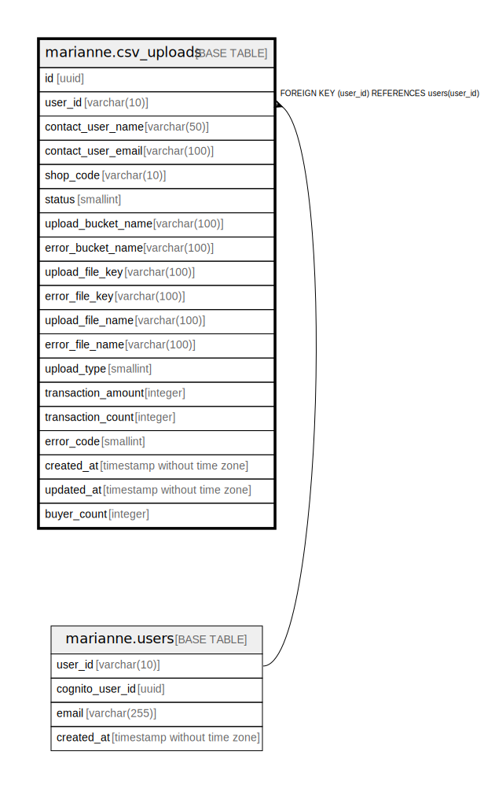

# marianne.csv_uploads

## Description

## Columns

| Name | Type | Default | Nullable | Children | Parents | Comment |
| ---- | ---- | ------- | -------- | -------- | ------- | ------- |
| id | uuid |  | false |  |  |  |
| user_id | varchar(10) |  | false |  | [marianne.users](marianne.users.md) |  |
| contact_user_name | varchar(50) |  | false |  |  |  |
| contact_user_email | varchar(100) |  | false |  |  |  |
| shop_code | varchar(10) |  | false |  |  |  |
| status | smallint |  | false |  |  |  |
| upload_bucket_name | varchar(100) |  | false |  |  |  |
| error_bucket_name | varchar(100) |  | true |  |  |  |
| upload_file_key | varchar(100) |  | false |  |  |  |
| error_file_key | varchar(100) |  | true |  |  |  |
| upload_file_name | varchar(100) |  | false |  |  |  |
| error_file_name | varchar(100) |  | true |  |  |  |
| upload_type | smallint |  | false |  |  |  |
| transaction_amount | integer |  | true |  |  |  |
| transaction_count | integer |  | true |  |  |  |
| error_code | smallint |  | true |  |  |  |
| created_at | timestamp without time zone | CURRENT_TIMESTAMP | false |  |  |  |
| updated_at | timestamp without time zone |  | false |  |  |  |
| buyer_count | integer |  | true |  |  |  |

## Constraints

| Name | Type | Definition |
| ---- | ---- | ---------- |
| transaction_csv_uploads_user_id_fkey | FOREIGN KEY | FOREIGN KEY (user_id) REFERENCES users(user_id) |
| transaction_csv_uploads_pkey | PRIMARY KEY | PRIMARY KEY (id) |

## Indexes

| Name | Definition |
| ---- | ---------- |
| transaction_csv_uploads_pkey | CREATE UNIQUE INDEX transaction_csv_uploads_pkey ON marianne.csv_uploads USING btree (id) |
| csv_uploads_shop_code_idx | CREATE INDEX csv_uploads_shop_code_idx ON marianne.csv_uploads USING btree (shop_code) |
| csv_uploads_shop_code_upload_type_status_idx | CREATE INDEX csv_uploads_shop_code_upload_type_status_idx ON marianne.csv_uploads USING btree (shop_code, upload_type, status) |

## Relations

---

> Generated by [tbls](https://github.com/k1LoW/tbls)
