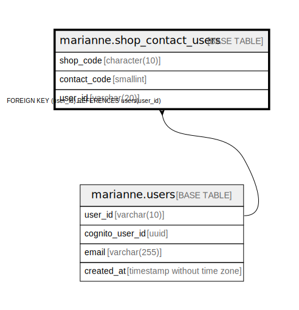

# marianne.shop_contact_users

## Description

## Columns

| Name | Type | Default | Nullable | Children | Parents | Comment |
| ---- | ---- | ------- | -------- | -------- | ------- | ------- |
| shop_code | character(10) |  | false |  |  |  |
| contact_code | smallint |  | false |  |  |  |
| user_id | varchar(20) |  | false |  | [marianne.users](marianne.users.md) |  |

## Constraints

| Name | Type | Definition |
| ---- | ---- | ---------- |
| fk_shop_contact_users_user_id | FOREIGN KEY | FOREIGN KEY (user_id) REFERENCES users(user_id) |
| pk_shop_contact_users | PRIMARY KEY | PRIMARY KEY (shop_code, contact_code) |
| uq_shop_contact_users | UNIQUE | UNIQUE (shop_code, user_id) |

## Indexes

| Name | Definition |
| ---- | ---------- |
| pk_shop_contact_users | CREATE UNIQUE INDEX pk_shop_contact_users ON marianne.shop_contact_users USING btree (shop_code, contact_code) |
| uq_shop_contact_users | CREATE UNIQUE INDEX uq_shop_contact_users ON marianne.shop_contact_users USING btree (shop_code, user_id) |

## Relations

---

> Generated by [tbls](https://github.com/k1LoW/tbls)
