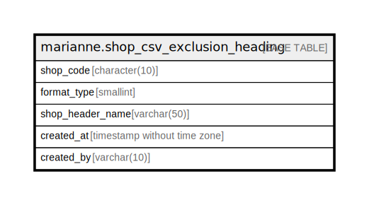

# marianne.shop_csv_exclusion_heading

## Description

## Columns

| Name | Type | Default | Nullable | Children | Parents | Comment |
| ---- | ---- | ------- | -------- | -------- | ------- | ------- |
| shop_code | character(10) |  | false |  |  |  |
| format_type | smallint |  | false |  |  |  |
| shop_header_name | varchar(50) |  | false |  |  |  |
| created_at | timestamp without time zone | CURRENT_TIMESTAMP | false |  |  |  |
| created_by | varchar(10) |  | false |  |  |  |

## Constraints

| Name | Type | Definition |
| ---- | ---- | ---------- |
| pk_shop_csv_exclusion_heading | PRIMARY KEY | PRIMARY KEY (shop_code, format_type, shop_header_name) |

## Indexes

| Name | Definition |
| ---- | ---------- |
| pk_shop_csv_exclusion_heading | CREATE UNIQUE INDEX pk_shop_csv_exclusion_heading ON marianne.shop_csv_exclusion_heading USING btree (shop_code, format_type, shop_header_name) |

## Relations

---

> Generated by [tbls](https://github.com/k1LoW/tbls)
