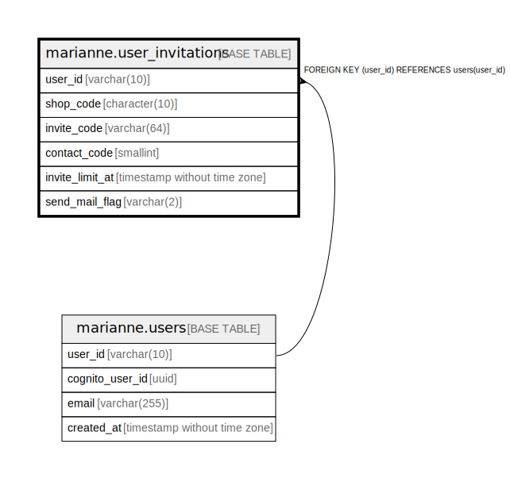

# marianne.user_invitations

## Description

## Columns

| Name | Type | Default | Nullable | Children | Parents | Comment |
| ---- | ---- | ------- | -------- | -------- | ------- | ------- |
| user_id | varchar(10) |  | false |  | [marianne.users](marianne.users.md) |  |
| shop_code | character(10) |  | false |  |  |  |
| invite_code | varchar(64) |  | false |  |  |  |
| contact_code | smallint |  | true |  |  |  |
| invite_limit_at | timestamp without time zone |  | false |  |  |  |
| send_mail_flag | varchar(2) |  | false |  |  |  |

## Constraints

| Name | Type | Definition |
| ---- | ---- | ---------- |
| fk_user_invitations_user_id | FOREIGN KEY | FOREIGN KEY (user_id) REFERENCES users(user_id) |
| pk_user_invitations | PRIMARY KEY | PRIMARY KEY (user_id, shop_code) |
| uq_user_invitations_invite_code | UNIQUE | UNIQUE (invite_code) |

## Indexes

| Name | Definition |
| ---- | ---------- |
| pk_user_invitations | CREATE UNIQUE INDEX pk_user_invitations ON marianne.user_invitations USING btree (user_id, shop_code) |
| uq_user_invitations_invite_code | CREATE UNIQUE INDEX uq_user_invitations_invite_code ON marianne.user_invitations USING btree (invite_code) |

## Relations

---

> Generated by [tbls](https://github.com/k1LoW/tbls)
