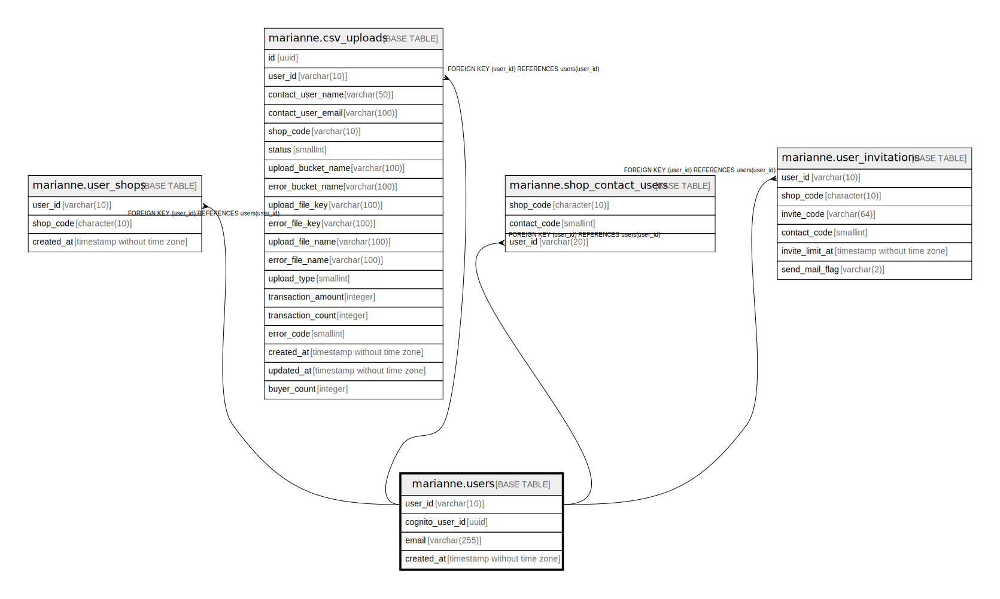

# marianne.users

## Description

## Columns

| Name | Type | Default | Nullable | Children | Parents | Comment |
| ---- | ---- | ------- | -------- | -------- | ------- | ------- |
| user_id | varchar(10) |  | false | [marianne.user_shops](marianne.user_shops.md) [marianne.csv_uploads](marianne.csv_uploads.md) [marianne.shop_contact_users](marianne.shop_contact_users.md) [marianne.user_invitations](marianne.user_invitations.md) |  |  |
| cognito_user_id | uuid |  | true |  |  |  |
| email | varchar(255) |  | false |  |  |  |
| created_at | timestamp without time zone | CURRENT_TIMESTAMP | false |  |  |  |

## Constraints

| Name | Type | Definition |
| ---- | ---- | ---------- |
| pk_users | PRIMARY KEY | PRIMARY KEY (user_id) |
| uq_users | UNIQUE | UNIQUE (email) |

## Indexes

| Name | Definition |
| ---- | ---------- |
| pk_users | CREATE UNIQUE INDEX pk_users ON marianne.users USING btree (user_id) |
| uq_users | CREATE UNIQUE INDEX uq_users ON marianne.users USING btree (email) |

## Relations

---

> Generated by [tbls](https://github.com/k1LoW/tbls)
